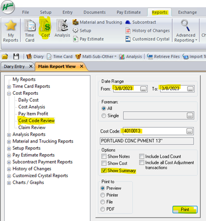

## Introduction

Heavy Job software is an essential tool for construction project management, offering a range of functionalities to streamline processes. One of the critical features is the ability to run Cost Code Reports. These reports provide invaluable insights into the financial aspects of your projects, allowing you to track and manage costs effectively. In this guide, we’ll walk you through the process of generating these reports, ensuring you have the detailed financial data you need for your project’s success.

## Step-by-Step Instructions

1. **Open Job** - Access the project for which you need the report.

2. **Click on Reports Tab** - Navigate to the reports section of the software.

3. **Click on “Cost” at the Top** - This takes you to the cost-related report options.

4. **Select “Cost Code Review”** - Choose this specific report type for detailed cost code analysis.

5. **Enter Date Range** - Specify the time frame for the report.

6. **Enter Cost Code** - Input the specific cost code you wish to analyze.

7. **Select Options**
      - Keep “Show Summary” selected for an overview. 
      - Keep “Show Cost” selected to view costs associated with hours.
     - This is particularly useful for ensuring accuracy in cost entries.

8. **Select Print to Option** - Preferably use Preview to check data accuracy before printing or saving.

## Summary

The process of running Cost Code Reports in Heavy Job is straightforward and highly beneficial for project cost management. By following these steps, you can efficiently generate detailed reports on cost codes, ensuring accurate tracking and analysis of project expenses. This guide provides a clear and concise method to utilize one of the many powerful features of Heavy Job software, aiding in effective project management.
