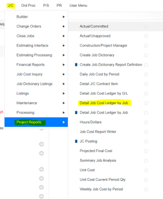
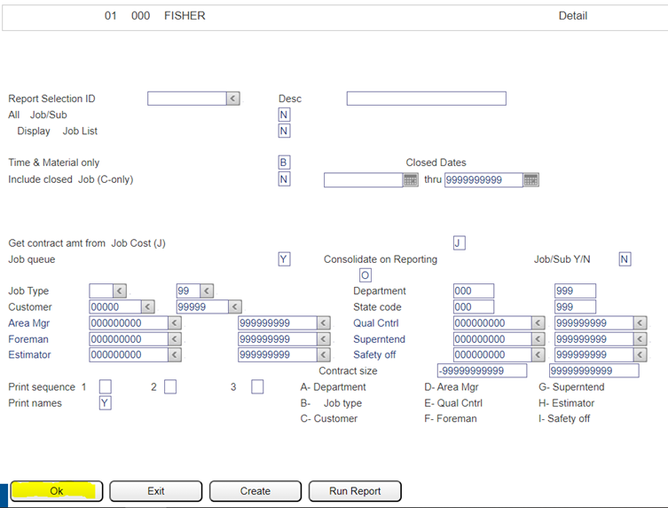
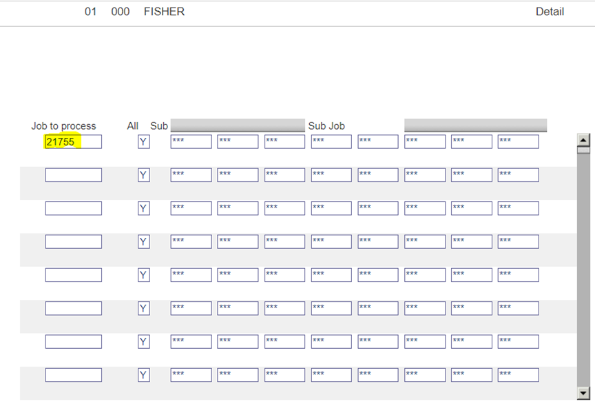
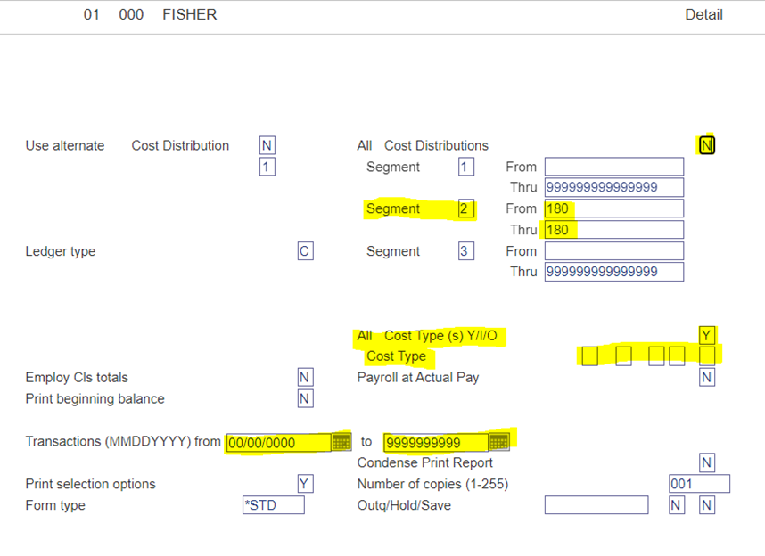

## Introduction

Managing financials effectively is a key component of successful project management. One crucial aspect of this is the ability to run detailed cost reports for specific phases or cost codes. Below are the steps to generate these reports using eCMS, ensuring you have accurate and relevant financial data at your fingertips.

## Step-by-Step Guide

1. **Navigate to the Report Section**
      - In eCMS, go to JC → Project Reports → Detailed Job Cost Ledger by Job.

2. **Initial Confirmation**
      - Select “Ok” on the first page to proceed.

3. **Job Number Entry**
      - On the second page, enter the job number and then select “Ok”.

4. **Selecting Phase/Cost Code**
      - On the third page, you'll choose the specific phase or cost code for the report.
        - All Cost Distributions: Set to 'N'.
        - Segment 1 (Phase): For example, enter '190101' for the phase.
        - Segment 2 (Cost Code): For example, enter '180' for the cost code.
        - Specific Cost Type (Optional):
            - Includes (I): Enter any cost types you want to include in the report under 'Cost Type.'
            - Omits (O): Enter any cost types you want to omit from the report under 'Cost Type.'
        - Transactions:
            - For a report covering the life of the job, keep the default settings.
            - To run the report for a specific time frame, select the desired dates.

## Conclusion

By following these steps, you can efficiently generate detailed cost reports for specific phases or cost codes in eCMS. This process is integral for maintaining an accurate overview of your project's financial health and allows for more strategic decision-making based on precise financial data.
